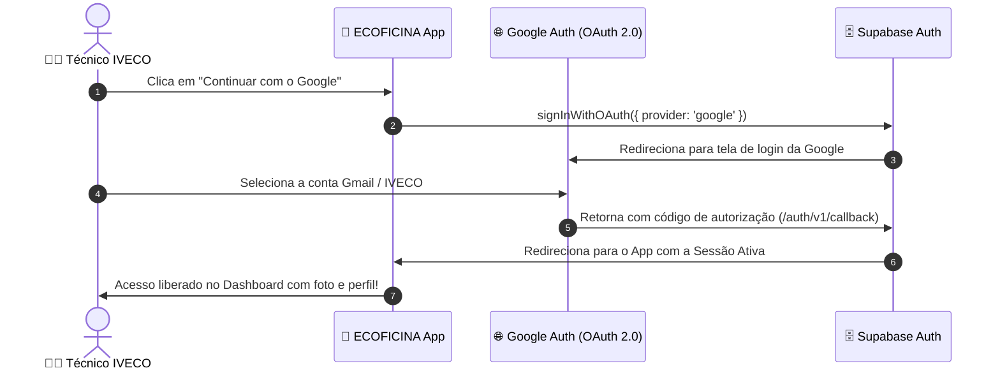

# 🔑 Guia de Configuração: Login com o Google no Supabase — ECOFICINA IVECO 2.0

Este documento ensina o **passo a passo detalhado** para ativar o **Login com o Google (Google OAuth 2.0)** no seu projeto Supabase (`https://zlnmsdervqnbikgxnusr.supabase.co`) e no aplicativo.

---

## 📑 Sumário
1. [Visão Geral do Fluxo](#1-visão-geral-do-fluxo)
2. [Passo 1: Criar as Credenciais no Google Cloud Console](#passo-1-criar-as-credenciais-no-google-cloud-console)
3. [Passo 2: Ativar o Provedor Google no Supabase](#passo-2-ativar-o-provedor-google-no-supabase)
4. [Passo 3: Configurar as URLs de Redirecionamento](#passo-3-configurar-as-urls-de-redirecionamento)
5. [Como Funciona no Código do Aplicativo](#5-como-funciona-no-código-do-aplicativo)

---

## 1. Visão Geral do Fluxo



---

## Passo 1: Criar as Credenciais no Google Cloud Console

1. Acesse o console de desenvolvedores do Google:
   👉 **[https://console.cloud.google.com/](https://console.cloud.google.com/)**
2. Faça login com sua conta Google.
3. No topo da página, clique no seletor de projetos e crie um **"Novo Projeto"** (ex: `IVECO-ECOFICINA`).

### 1.1 Configurar a Tela de Consentimento (OAuth Consent Screen)
1. No menu lateral esquerdo, vá em **APIs e Serviços** > **Tela de consentimento OAuth** (*OAuth consent screen*).
2. Escolha **External** (Externo) e clique em **Criar**.
3. Preencha os campos obrigatórios:
   - **Nome do app**: `ECOFICINA IVECO 2.0`
   - **E-mail de suporte do usuário**: Seu e-mail
   - **E-mail de contato do desenvolvedor**: Seu e-mail
4. Clique em **Salvar e continuar**.
5. Na etapa de **Escopos (Scopes)**, clique em **Salvar e continuar** (os escopos padrão `email`, `profile` e `openid` já são incluídos).
6. Em **Usuários de teste**, adicione os e-mails do Google que irão testar o app (ou publique o app para liberar todos).
7. Clique em **Voltar para o painel**.

### 1.2 Criar o ID do Cliente OAuth (Client ID & Client Secret)
1. No menu lateral, clique em **Credenciais** (*Credentials*).
2. Clique no botão superior **+ Criar Credenciais** > **ID do cliente OAuth** (*OAuth client ID*).
3. Em **Tipo de aplicativo**, selecione: **Aplicativo da Web** (*Web application*).
4. Em **Nome**, defina: `ECOFICINA Web Client`.
5. Em **Origens JavaScript autorizadas** (*Authorized JavaScript origins*), adicione:
   - `http://localhost:5173`
   - `https://zlnmsdervqnbikgxnusr.supabase.co`
   - A URL do seu GitHub Pages ou Vercel (se já tiver publicado)
6. Em **URIs de redirecionamento autorizados** (*Authorized redirect URIs*), adicione **obrigatoriamente**:
   - `https://zlnmsdervqnbikgxnusr.supabase.co/auth/v1/callback`
   - `http://localhost:5173`
7. Clique em **Criar**.
8. Uma janela pop-up será exibida com:
   - **Seu ID de cliente** (ex: `123456789-abcdef.apps.googleusercontent.com`)
   - **Sua chave secreta do cliente** (ex: `GOCSPX-xxxxxxxxxxxxx`)
9. **Copie e guarde esses dois valores.**

---

## Passo 2: Ativar o Provedor Google no Supabase

1. Acesse o painel do seu projeto no Supabase:
   👉 **[https://supabase.com/dashboard/project/zlnmsdervqnbikgxnusr](https://supabase.com/dashboard/project/zlnmsdervqnbikgxnusr)**
2. No menu lateral esquerdo, clique no ícone de escudo **Authentication** > **Providers**.
3. Na lista de provedores, clique em **Google** para expandir as opções.
4. Marque a chave **"Enable Google provider"** como **ON** (Habilitada).
5. Cole os valores gerados no Google Cloud:
   - **Client ID (for OAuth)**: Cole seu *ID de cliente*.
   - **Client Secret (for OAuth)**: Cole sua *chave secreta do cliente*.
6. Clique no botão verde **Save** (Salvar) no canto inferior direito.

---

## Passo 3: Configurar as URLs de Redirecionamento

1. No painel do Supabase, vá em **Authentication** > **URL Configuration**.
2. No campo **Site URL**, informe a URL principal da sua aplicação:
   - Para desenvolvimento local: `http://localhost:5173`
   - Para produção: A URL do seu app publicado (ex: `https://seu-app.vercel.app` ou `https://adrianomazettosenai.github.io/app_iveco`)
3. Em **Redirect URLs**, adicione:
   - `http://localhost:5173/**`
   - `https://*`
4. Clique em **Save**.

---

## 5. Como Funciona no Código do Aplicativo

O aplicativo já está **100% integrado e pronto para usar**:

1. **Na Tela de Login ([`AuthScreens.jsx`](file:///C:/Users/adria/OneDrive/Área%20de%20Trabalho/IVECO_APP/src/screens/AuthScreens.jsx#L79))**:
   - O botão oficial com o logo do Google executa a função `signInWithGoogle()`.

2. **No Serviço Supabase ([`supabaseService.js`](file:///C:/Users/adria/OneDrive/Área%20de%20Trabalho/IVECO_APP/src/services/supabaseService.js))**:
   ```javascript
   export async function signInWithGoogle() {
     const { data, error } = await supabase.auth.signInWithOAuth({
       provider: 'google',
       options: {
         redirectTo: window.location.origin
       }
     });
     if (error) throw error;
     return data;
   }
   ```

3. **No Sincronizador de Sessão ([`App.jsx`](file:///C:/Users/adria/OneDrive/Área%20de%20Trabalho/IVECO_APP/src/App.jsx#L107))**:
   - O `supabase.auth.onAuthStateChange` detecta quando o usuário retorna do login da Google e extrai automaticamente o **Nome**, **E-mail** e **Foto de Perfil** do técnico para preencher a plataforma.
