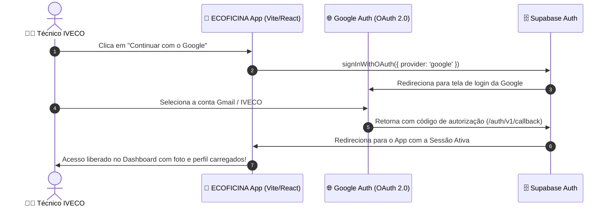

# 🔑 Guia de Configuração: Login com Google no Supabase — ECOFICINA IVECO 2.0

Este guia contém o **passo a passo detalhado** para configurar e ativar a autenticação com conta Google (**Google OAuth 2.0**) no seu projeto **Supabase** e no aplicativo **ECOFICINA IVECO 2.0**.

---

## 📑 Sumário

1. [Visão Geral da Arquitetura](#1-visão-geral-da-arquitetura)
2. [Passo 1: Criar Projeto no Google Cloud Console](#passo-1-criar-projeto-no-google-cloud-console)
3. [Passo 2: Configurar a Tela de Consentimento OAuth](#passo-2-configurar-a-tela-de-consentimento-oauth)
4. [Passo 3: Gerar Credenciais OAuth (Client ID & Client Secret)](#passo-3-gerar-credenciais-oauth-client-id--client-secret)
5. [Passo 4: Ativar o Provedor Google no Supabase](#passo-4-ativar-o-provedor-google-no-supabase)
6. [Passo 5: Configurar URLs de Redirecionamento no Supabase](#passo-5-configurar-urls-de-redirecionamento-no-supabase)
7. [Passo 6: Como o Código do App Executa o Login](#passo-6-como-o-código-do-app-executa-o-login)
8. [Perguntas Frequentes & Resolução de Problemas (Troubleshooting)](#perguntas-frequentes--resolução-de-problemas-troubleshooting)

---

## 1. Visão Geral da Arquitetura



---

## Passo 1: Criar Projeto no Google Cloud Console

1. Acesse o **Google Cloud Console**:
   👉 [https://console.cloud.google.com/](https://console.cloud.google.com/)
2. Faça login com sua conta Google.
3. No topo da tela, clique no seletor de projetos e selecione **Novo Projeto** (*New Project*).
4. Defina o nome do projeto (ex: `IVECO-ECOFICINA`) e clique em **Criar** (*Create*).
5. Certifique-se de que o projeto recém-criado está selecionado no topo da página.

---

## Passo 2: Configurar a Tela de Consentimento OAuth

1. No menu lateral esquerdo (☰), navegue até **APIs e Serviços** > **Tela de consentimento OAuth** (*OAuth consent screen*).
2. Escolha o tipo de usuário:
   - Selecione **Externo** (*External*) e clique em **Criar** (*Create*).
3. Preencha as informações básicas do aplicativo:
   - **Nome do app**: `ECOFICINA IVECO 2.0`
   - **E-mail para suporte do usuário**: Selecione o seu e-mail.
   - **Logotipo do app**: (Opcional) Faça upload do ícone da aplicação.
   - **Domínio do aplicativo**: Pode deixar em branco durante o desenvolvimento.
   - **Dados de contato do desenvolvedor**: Digite o seu e-mail.
4. Clique em **Salvar e continuar** (*Save and continue*).
5. Na etapa de **Escopos** (*Scopes*):
   - Clique em **Salvar e continuar** (os escopos básicos `email`, `profile` e `openid` já são adicionados por padrão).
6. Na etapa de **Usuários de teste** (*Test users*):
   - Clique em **+ Add Users** e adicione o seu e-mail do Google (e de quem for testar a aplicação enquanto o app estiver em modo de teste).
   - Clique em **Salvar e continuar**.
7. Na página de resumo, clique em **Voltar para o painel**.

---

## Passo 3: Gerar Credenciais OAuth (Client ID & Client Secret)

1. No menu lateral esquerdo, clique em **Credenciais** (*Credentials*).
2. No menu superior, clique em **+ Criar Credenciais** (*+ Create Credentials*) > **ID do cliente OAuth** (*OAuth client ID*).
3. Preencha os campos da seguinte forma:
   - **Tipo de aplicativo** (*Application type*): Selecione **Aplicativo da Web** (*Web application*).
   - **Nome** (*Name*): `ECOFICINA Web Client`.
   - **Origens JavaScript autorizadas** (*Authorized JavaScript origins*):
     - `http://localhost:5173`
     - `http://localhost:3000` (se aplicável)
     - `https://zlnmsdervqnbikgxnusr.supabase.co`
     - URL de produção (se já tiver hospedado, ex: `https://seu-dominio.com` ou Vercel)
   - **URIs de redirecionamento autorizados** (*Authorized redirect URIs*):
     > ⚠️ **ATENÇÃO:** O Supabase precisa receber a resposta da Google neste endpoint exato:
     - `https://zlnmsdervqnbikgxnusr.supabase.co/auth/v1/callback`
     - `http://localhost:5173`
4. Clique em **Criar** (*Create*).
5. Uma janela pop-up será exibida com as suas credenciais:
   - **ID do cliente** (*Client ID*): algo como `123456789-abcdefghijk.apps.googleusercontent.com`
   - **Chave secreta do cliente** (*Client Secret*): algo como `GOCSPX-xxxxxxxxxxxxxxxxxxxxxxxx`
6. **Copie e guarde esses dois valores com segurança.**

---

## Passo 4: Ativar o Provedor Google no Supabase

1. Acesse o painel do seu projeto no **Supabase**:
   👉 [https://supabase.com/dashboard/project/zlnmsdervqnbikgxnusr](https://supabase.com/dashboard/project/zlnmsdervqnbikgxnusr)
2. No menu lateral esquerdo, clique no ícone de escudo **Authentication** (Autenticação) e depois em **Providers** (Provedores).
3. Localize **Google** na lista de provedores e clique para expandir.
4. Marque a opção **Enable Google provider** como **ON** (Habilitado).
5. Preencha os campos com as credenciais que você obteve no Google Cloud:
   - **Client ID (for OAuth)**: Cole o seu *ID do cliente*.
   - **Client Secret (for OAuth)**: Cole a sua *Chave secreta do cliente*.
6. Clique em **Save** (Salvar) no canto inferior direito do card.

---

## Passo 5: Configurar URLs de Redirecionamento no Supabase

1. No painel do Supabase, ainda na aba **Authentication**, clique em **URL Configuration** (Configuração de URL).
2. Configure os campos:
   - **Site URL**: URL padrão do seu app (ex: `http://localhost:5173` para desenvolvimento local ou a URL final do deploy).
   - **Redirect URLs**: Adicione as URLs permitidas para onde o Supabase pode redirecionar o usuário após o login:
     - `http://localhost:5173/**`
     - `http://localhost:5173`
     - `https://*` (ou a URL exata da sua hospedagem)
3. Clique em **Save** (Salvar).

---

## Passo 6: Como o Código do App Executa o Login

O código da aplicação já está integrado e utiliza a biblioteca oficial do Supabase:

### 1. Chamada de Login no Serviço ([`supabaseService.js`](file:///C:/Users/adria/OneDrive/Área%20de%20Trabalho/IVECO_APP/src/services/supabaseService.js))
```javascript
export async function signInWithGoogle() {
  const { data, error } = await supabase.auth.signInWithOAuth({
    provider: 'google',
    options: {
      redirectTo: window.location.origin
    }
  });
  if (error) throw error;
  return data;
}
```

### 2. Botão de Login na Interface ([`AuthScreens.jsx`](file:///C:/Users/adria/OneDrive/Área%20de%20Trabalho/IVECO_APP/src/screens/AuthScreens.jsx))
```jsx
<button
  type="button"
  onClick={handleGoogleLogin}
  className="w-full flex items-center justify-center gap-3 bg-white text-slate-700 border border-slate-300 py-3.5 rounded-xl font-bold hover:bg-slate-50 transition shadow-sm"
>
  
  Continuar com o Google
</button>
```

### 3. Escuta do Estado de Autenticação ([`App.jsx`](file:///C:/Users/adria/OneDrive/Área%20de%20Trabalho/IVECO_APP/src/App.jsx))
```javascript
const { data: { subscription } } = supabase.auth.onAuthStateChange(async (event, session) => {
  if (session?.user) {
    const googleUser = {
      id: session.user.id,
      email: session.user.email,
      name: session.user.user_metadata?.full_name || session.user.user_metadata?.name || 'Técnico IVECO',
      avatar: session.user.user_metadata?.avatar_url || session.user.user_metadata?.picture,
      role: 'tecnico'
    };
    setUser(googleUser);
  }
});
```

---

## Perguntas Frequentes & Resolução de Problemas (Troubleshooting)

### 🔴 Erro: `redirect_uri_mismatch` (400)
- **Causa**: A URL de retorno cadastrada no Google Cloud Console não é exatamente igual à esperada pelo Supabase.
- **Solução**: Vá no Google Cloud Console > **Credenciais** > Edite o **ID do cliente OAuth** e certifique-se de que `https://zlnmsdervqnbikgxnusr.supabase.co/auth/v1/callback` está adicionada na seção **URIs de redirecionamento autorizados**.

### 🔴 Erro: "Acesso bloqueado: o app não concluiu o processo de verificação do Google"
- **Causa**: O aplicativo no Google Cloud está no status de publicação "Teste" (*Testing*) e a conta que tentou logar não está na lista de usuários de teste.
- **Solução**: Vá em **Tela de consentimento OAuth** > **Usuários de teste** > Adicione o e-mail da sua conta Google ou clique no botão **Publicar aplicativo** (*Publish app*) para liberar qualquer e-mail.

### 🔴 Erro: `unauthorized_client`
- **Causa**: O *Client ID* ou *Client Secret* preenchidos no Supabase estão incorretos ou com espaços em branco no início/fim.
- **Solução**: Reabra o Supabase > **Authentication** > **Providers** > **Google** e copie novamente os valores do Google Cloud Console.
