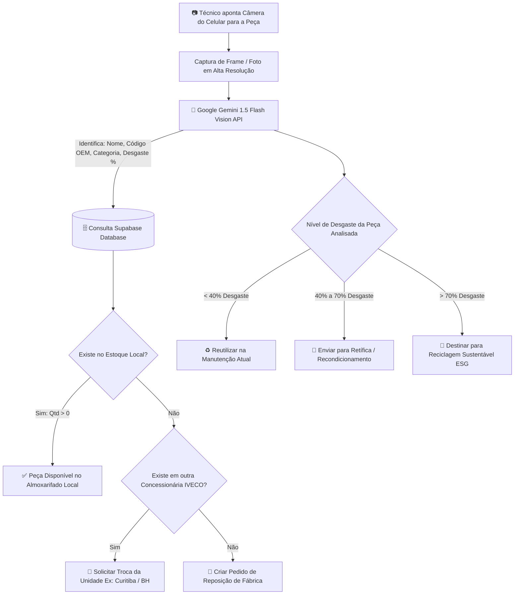

# 📷 Guia do Scanner com IA (Google Gemini Vision) e Comparação de Estoque no Supabase — ECOFICINA IVECO 2.0

Este documento apresenta o **passo a passo para ativar a API Gratuita do Google (Gemini Vision)** no aplicativo, o **plano estratégico para cadastrar peças** e a **arquitetura de comparação automática com o banco de dados Supabase**.

---

## 📑 Sumário
1. [Como Obter a API Gratuita do Google Gemini](#1-como-obter-a-api-gratuita-do-google-gemini)
2. [Como Configurar a Chave no Aplicativo](#2-como-configurar-a-chave-no-aplicativo)
3. [Plano de Cadastro e Catalogação de Peças](#3-plano-de-cadastro-e-catalogação-de-peças)
4. [Fluxo de Identificação e Comparação com o Estoque](#4-fluxo-de-identificação-e-comparação-com-o-estoque)
5. [Consultas SQL e Lógica de Busca no Supabase](#5-consultas-sql-e-lógica-de-busca-no-supabase)

---

## 1. Como Obter a API Gratuita do Google Gemini

O **Google Gemini 1.5 Flash** possui um plano gratuito (**Free Tier**) oficial para desenvolvedores que permite até **15 requisições por minuto (RPM)** e **1.500 requisições por dia**, sem necessidade de cartão de crédito.

### 🚀 Passo a Passo para Gerar sua Chave:

1. Acesse o portal oficial de desenvolvedores do Google:
   👉 **[https://aistudio.google.com/](https://aistudio.google.com/)**
2. Faça login com sua conta Google (Gmail).
3. No canto superior esquerdo, clique no botão azul **"Get API key"** (Obter chave de API).
4. Clique em **"Create API key"** (Criar chave de API) e selecione **"Create API key in new project"** (ou escolha um projeto existente no Google Cloud).
5. Copie a chave gerada (ela começa com `AIzaSy...`).

---

## 2. Como Configurar a Chave no Aplicativo

1. Abra o arquivo `.env` na raiz do projeto (`IVECO_APP/.env`).
2. Adicione a variável `VITE_GEMINI_API_KEY` com a chave que você gerou:

```env
VITE_SUPABASE_URL=https://zlnmsdervqnbikgxnusr.supabase.co
VITE_SUPABASE_ANON_KEY=sb_publishable_cgq1xSue7rsM9uIBscOIdw_VvOxAE3y
VITE_GEMINI_API_KEY=AIzaSySuaChaveDoGoogleAqui
```

3. Pronto! O serviço de visão computacional em [`src/services/aiVisionService.js`](file:///C:/Users/adria/OneDrive/Área%20de%20Trabalho/IVECO_APP/src/services/aiVisionService.js) já está programado para utilizar esta chave automaticamente ao capturar fotos com a câmera do celular.

---

## 3. Plano de Cadastro e Catalogação de Peças

Para que a inteligência artificial reconheça as peças e encontre correspondências precisas no banco de dados, recomendamos a seguinte estrutura de catalogação:

### 🧩 Estrutura Recomendada da Peça (`parts` no Supabase):

| Campo | Tipo | Exemplo | Descrição |
| :--- | :--- | :--- | :--- |
| `code` | VARCHAR(50) | `504385987` | Código OEM original gravado na carcaça IVECO |
| `name` | TEXT | `Alternador 28V 100A` | Nome técnico padronizado |
| `category` | TEXT | `Elétrico` | Categoria (Elétrico, Frenagem, Pneumático, Motor, Suspensão) |
| `compatibility` | TEXT | `IVECO S-WAY • TECTOR` | Modelos de caminhão compatíveis |
| `condition` | TEXT | `Reutilizável` | Estado inicial: `Reutilizável`, `Recuperável`, `Descarte` |
| `wear_percentage` | INT | `20` | % de desgaste físico estimado (0% a 100%) |
| `health_percent` | INT | `80` | % de saúde/vida útil restante |
| `quantity` | INT | `3` | Quantidade disponível no almoxarifado |
| `unit_id` | VARCHAR(50) | `sp` | ID da concessionária proprietária (`sp`, `curitiba`, `bh`, etc.) |
| `location` | TEXT | `Almox. B - Prat. 04` | Localização física exata na oficina |
| `available_for_exchange` | BOOLEAN | `true` | Se outras concessionárias podem solicitar |
| `co2_savings_kg` | NUMERIC | `38` | CO₂ evitado ao reaproveitar esta peça |

---

### 📝 Como Cadastrar Novas Peças:

#### Método A: Pelo Próprio Aplicativo (Técnico na Oficina)
1. Acesse a aba **Estoque** e clique no botão **"+ Adicionar"**.
2. O técnico pode:
   - Apontar a câmera para o **QR Code** ou código de barras da peça para preenchimento automático.
   - Digitar o código da peça, quantidade e localização na prateleira.
3. Ao clicar em **"Confirmar Cadastro"**, a peça é salva instantaneamente no Supabase.

#### Método B: Carga em Massa via SQL (Importação Inicial)
No **SQL Editor** do Supabase, você pode cadastrar lotes de peças executando:

```sql
INSERT INTO public.parts (
  code, name, category, manufacturer, compatibility, 
  year, condition, wear_percentage, health_percent, 
  status, quantity, unit_id, location, available_for_exchange, co2_savings_kg
) VALUES
('504385987', 'Alternador 28V 100A', 'Elétrico', 'IVECO / Bosch', 'IVECO S-WAY', '2023', 'Reutilizável', 20, 80, 'available', 3, 'sp', 'Almoxarifado B — Prat. 04', true, 38),
('5801215774', 'Compressor de Ar Monocilíndrico', 'Pneumático', 'IVECO / Knorr', 'IVECO S-WAY', '2022', 'Reutilizável', 25, 75, 'available', 2, 'sp', 'Almoxarifado A — Prat. 02', true, 52),
('50418756', 'Suporte do Eixo Traseiro', 'Suspensão', 'IVECO Heavy Parts', 'IVECO S-WAY', '2022', 'Reutilizável', 18, 82, 'available', 2, 'sp', 'Almoxarifado D — Box 14', true, 45);
```

---

## 4. Fluxo de Identificação e Comparação com o Estoque



---

## 5. Consultas SQL e Lógica de Busca no Supabase

Quando a IA do Google identifica a peça (por exemplo, código `50418756` ou nome `Suporte do Eixo`), o serviço executa duas buscas simultâneas no Supabase:

### 1️⃣ Busca no Estoque Local:
```sql
SELECT * FROM public.parts
WHERE unit_id = 'sp'
  AND (code ILIKE '%50418756%' OR name ILIKE '%Suporte do Eixo%')
  AND status = 'available';
```

### 2️⃣ Busca na Rede de Concessionárias (Marketplace Interno IVECO):
```sql
SELECT 
  p.id, 
  p.name, 
  p.code, 
  p.quantity, 
  p.health_percent, 
  u.name AS unit_name, 
  u.city, 
  u.state, 
  u.distance_km
FROM public.parts p
JOIN public.units u ON p.unit_id = u.id
WHERE p.unit_id != 'sp'
  AND p.available_for_exchange = true
  AND (p.code ILIKE '%50418756%' OR p.name ILIKE '%Suporte do Eixo%')
ORDER BY u.distance_km ASC;
```

---

## 🛠️ Tecnologias e Arquivos Envolvidos no App

- [`src/components/CameraView.jsx`](file:///C:/Users/adria/OneDrive/Área%20de%20Trabalho/IVECO_APP/src/components/CameraView.jsx): Gerenciador da câmera nativa do dispositivo móvel (HTML5 `MediaDevices.getUserMedia`, alternância de lentes, captura de frames e upload de galeria).
- [`src/services/aiVisionService.js`](file:///C:/Users/adria/OneDrive/Área%20de%20Trabalho/IVECO_APP/src/services/aiVisionService.js): Integração direta com a API do Google Gemini 1.5 Flash e cruzamento de dados com o Supabase.
- [`src/screens/ScannerScreens.jsx`](file:///C:/Users/adria/OneDrive/Área%20de%20Trabalho/IVECO_APP/src/screens/ScannerScreens.jsx): Telas de câmera ao vivo para caminhões, componentes mecânicos e leitor de QR Code.
- [`src/screens/StockScreens.jsx`](file:///C:/Users/adria/OneDrive/Área%20de%20Trabalho/IVECO_APP/src/screens/StockScreens.jsx): Catálogo, estoque e marketplace de trocas interestaduais da rede IVECO.
